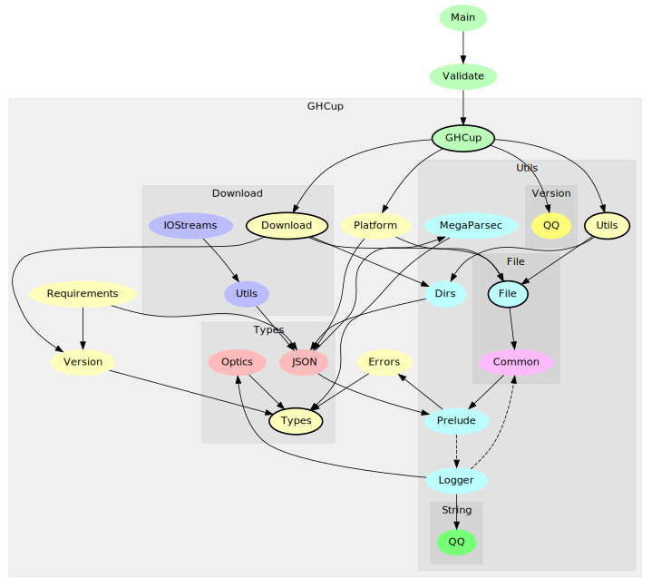

# Development and contribution

All you wanted to know about GHCup development.

## Building

GHCup supports development via cabal and stack. E.g.:

* build via stack: `stack build`
* build via cabal (with whatever GHC version): `cabal build`
* build via cabal reproducibly with a specific GHC version
    - GHC 8.10.7: `cabal build --project-file=cabal.ghc8107.project`
    - GHC 9.0.2: `cabal build --project-file=cabal.ghc902.project`
    - and so on (check supported versions via `ls cabal.ghc+([0-9]).project`)
* build the release binaries: `cabal build --project-file=cabal.project.release`

## Contribution process and expectations

* discuss your idea first before implementing anything
* GHCup is a dictatorship, so the final decisions are made by the author
* we don't manage contributors... you can work on anything you like
* reviews focus on logic and design, not on style and formatting
* remember that features, decisions and bugs are high impact, since GHCup is used in CIs, github workflows, etc.

## Module graph

[{: .center style="width:900px"}](./modules_wide.svg)

Main functionality is in `GHCup` module. Utility functions are
organised tree-ish in `GHCup.Utils` and `GHCup.Utils.*`.

Anything dealing with ghcup specific directories is in
`GHCup.Utils.Dirs`.

Download information on where to fetch bindists from is in the [ghcup-metadata](https://github.com/haskell/ghcup-metadata) repository.

## Design decisions

### Using [Excepts](https://hackage.haskell.org/package/haskus-utils-variant-3.0/docs/Haskus-Utils-Variant-Excepts.html) as a beefed up ExceptT

This is an open variant, similar to [plucky](https://hackage.haskell.org/package/plucky) or [oops](https://github.com/i-am-tom/oops) and allows us to combine different error types. Maybe it is too much and it's a little bit [unergonomic](https://github.com/haskus/packages/issues/32) at times. If it really hurts maintenance, it will be removed. It was more of an experiment.

### No use of haskell-TLS

I consider haskell-TLS an interesting experiment, but not a battle-tested and peer-reviewed crypto implementation. There is little to no research about what the intricacies of using haskell for low-level crypto are and how vulnerable such binaries are. Instead, we use either curl the binary or wget. There's also an implementation based on OpenSSL bindings, but it isn't enabled by default, since it would complicate shipping static binaries.

### Optics instead of lens

They're a little safer (less Monoid weirdness with view) and have better error messages. Consider the following with [lens](https://hackage.haskell.org/package/lens):

```
> view (_Just . to (++ "abc")) Nothing
""
```

vs [optics](https://hackage.haskell.org/package/optics):

```
> view (_Just % to (++ "abc")) Nothing

<interactive>:2:1: error:
    • An_AffineFold cannot be used as A_Getter
    • In the expression: view (_Just % to (++ "abc")) Nothing
      In an equation for ‘it’: it = view (_Just % to (++ "abc")) Nothing
```

### StrictData on by default

Kazu Yamamoto [explained it in his PR](https://github.com/yesodweb/wai/pull/752#issuecomment-501531386) very well. I like to agree with him. The instances where we need non-strict behavior, we annotate it.

`Strict` is a little more odd as a default, since it depends on how you define your functions as well.

## Code style and formatting

Unfortunately, code formatters are semi-broken on this codebase, due to TH and CPP.

Some light suggestions:

1. mtl-style preferred
2. no overly pointfree style
3. use `where` a lot, so the main function body reads like prose
4. documentation is part of the code

## Common tasks

### Adding a new GHC version

Head over to: [https://github.com/haskell/ghcup-metadata#adding-a-new-ghc-version](https://github.com/haskell/ghcup-metadata#adding-a-new-ghc-version)

### Adding a new CLI command

An example illustration on how to deal with [optparse-applicative](https://hackage.haskell.org/package/optparse-applicative) can be seen here: [https://github.com/haskell/ghcup-hs/commit/c19dd5ee8b2edbaf0336af143f1c75b6f4843e26](https://github.com/haskell/ghcup-hs/commit/c19dd5ee8b2edbaf0336af143f1c75b6f4843e26)

Every subcommand now lives in its own module under [GHCup.OptParse.MyCommand](https://github.com/haskell/ghcup-hs/tree/master/app/ghcup/GHCup/OptParse).

## Major refactors

1. First major refactor included adding cross support. This added
   `GHCTargetVersion`, which includes the target in addition to the version.
   Most of the `Version` parameters to functions had to be replaced with
   that and ensured the logic is consistent for cross and non-cross
   installs.
2. This refactor added windows support wrt [#130](https://gitlab.haskell.org/haskell/ghcup-hs/-/issues/130).
   The major changes here were switching `hpath` library out for `filepath`/`directory` (sadly) and
   introducing a non-unix way of handling processes via the `process` library. It also introduced considerable
   amounts of CPP wrt file handling, installation etc.
3. This refactor split up the huge `Main.hs` and put every subcommand in its own module: [#212](https://gitlab.haskell.org/haskell/ghcup-hs/-/merge_requests/212)

# Releasing

1. Update version in `ghcup.cabal`

2. Update `GHCup.Version` module. `ghcupURL` must only be updated if we change the `GHCupInfo` type or the YAML representation of it. The version of the YAML represents the change increments. `ghcUpVer` is the current application version, read from `ghcup.cabal`.

3. Add ChangeLog entry

4. If a new ghcup yaml version is needed, create one at [ghcup-metadata repo](https://github.com/haskell/ghcup-metadata) and push to a temporary release branch, then update the `data/metadata` submodule in ghcup-hs repo to that branch, so CI can pass

5. Commit and git push with tag. Wait for tests to succeed and release artifacts to build.

6. Download release artifacts and upload them `downloads.haskell.org/~ghcup` along with checksum files (also check `scripts/releasing/pull_release_artifacts.sh` and `scripts/releasing/sftp-upload-artifacts.sh`)

7. Add ghcup release artifacts to ALL yaml files, see [ghcup-metadata repo](https://github.com/haskell/ghcup-metadata)

8. Upload the final `ghcup-<ver>.yaml` (and a detached GPG sig of it) to `webhost.haskell.org/ghcup/data/` (for yaml versions <= 0.0.6) as well as [https://github.com/haskell/ghcup-metadata](https://github.com/haskell/ghcup-metadata) (for all versions).

9. Update version in `scripts/bootstrap/bootstrap-haskell` (`ghver` variable at the top of the script)

10. Upload `scripts/bootstrap/bootstrap-haskell` and `scripts/bootstrap/bootstrap-haskell.ps1` to `webhost.haskell.org/ghcup/sh/`

11. Update the top-level ghcup symlinks at `downloads.haskell.org/~ghcup` (see `scripts/releasing/sftp-symlink-artifacts.sh`)

12. Update the `data/metadata` submodule in ghcup-hs repo to master

13. Do hackage release

14. Post on reddit/discourse/etc. and collect rewards

# Documentation

This documentation page is built via [mkdocs](https://www.mkdocs.org/), see `mkdocs.yml` and `docs/` subfolder.
The module graph needs [graphmod](https://github.com/yav/graphmod) and is generated via `scripts/dev/modgraph.sh`.
