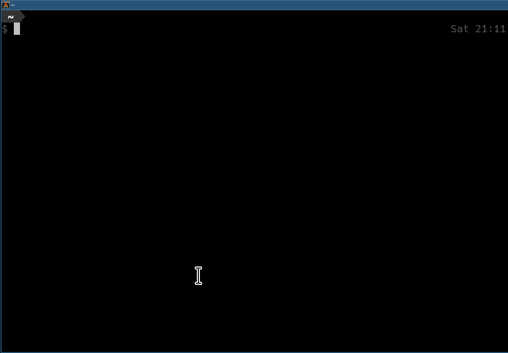

# GHCup

GHCup is an installer for the general purpose language [Haskell](https://www.haskell.org/).

----

GHCup makes it easy to install specific versions of GHC on GNU/Linux,
macOS (aka Darwin), FreeBSD and Windows and can also bootstrap a fresh [Haskell developer environment](./install/#supported-tools) from scratch.
It follows the unix UNIX philosophy of [do one thing and do it well](https://en.wikipedia.org/wiki/Unix_philosophy#Do_One_Thing_and_Do_It_Well). Similar in scope to [rustup](https://github.com/rust-lang-nursery/rustup.rs), [pyenv](https://github.com/pyenv/pyenv) and [jenv](http://www.jenv.be).

<a href="https://www.haskell.org/ghcup/" class="btn btn-primary" role="button">Quick Install</a>
<a href="install/" class="btn btn-primary" role="button">Getting Started</a>
<a href="guide/" class="btn btn-primary" role="button">User Guide</a>

----

