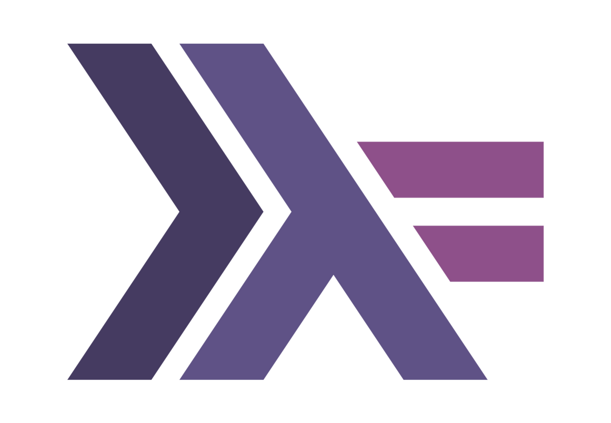

---
hide:
  - navigation
  - toc
---

<link rel="stylesheet" href="https://cdnjs.cloudflare.com/ajax/libs/font-awesome/4.7.0/css/font-awesome.min.css">

# {: .main-logo style="width:100px"} GHCup

GHCup is an installer for the general purpose language <a href="https://www.haskell.org">Haskell</a>.

<a href="install/" class="btn btn-primary" role="button">Getting Started</a>
<a href="guide/" class="btn btn-primary" role="button">User Guide</a>
<a href="https://gitlab.haskell.org/haskell/ghcup-hs/-/issues" class="btn btn-primary" role="button">Issue tracker</a>

<section class="qi-container">

    

      <h3>To install on Linux, macOS, FreeBSD or <a href="https://docs.microsoft.com/en-us/windows/wsl/"> WSL2</a></h3>
      
run the following in a terminal (as a non-root user):

      

	    <pre>
            curl --proto '=https' --tlsv1.2 -sSf https://get-ghcup.haskell.org | sh
          </pre>
        <button class="btn" onclick="copyToClipboardNux()" id="ghcup-linux-button"><i class="fa fa-copy"></i></button>
      

      
      
	

		<a href="https://gitlab.haskell.org/haskell/ghcup-hs/-/blob/master/scripts/bootstrap/bootstrap-haskell" target="_blank">What does this do?</a> <b>&nbsp;&middot;&nbsp;</b> <a href="https://www.haskell.org/ghcup/install/#manual-install">I don't like curl | sh</a> 
<b>&nbsp;&middot;&nbsp;</b> <a class="show-all-platforms-button" href="#">Show all platforms</a>

	

    

    

      <h3>To install on Windows</h3>
      
run the following in a PowerShell session (as a non-admin user):

      

	    <pre>
          Set-ExecutionPolicy Bypass -Scope Process -Force;[System.Net.ServicePointManager]::SecurityProtocol = [System.Net.ServicePointManager]::SecurityProtocol -bor 3072;Invoke-Command -ScriptBlock ([ScriptBlock]::Create((Invoke-WebRequest https://www.haskell.org/ghcup/sh/bootstrap-haskell.ps1 -UseBasicParsing))) -ArgumentList $true
          
        </pre>
        <button class="btn" onclick="copyToClipboardWin()" id="ghcup-windows-button"><i class="fa fa-copy"></i></button>
      

	

		<a href="https://gitlab.haskell.org/haskell/ghcup-hs/-/blob/master/scripts/bootstrap/bootstrap-haskell.ps1" target="_blank">What does this do?</a> <b>&nbsp;&middot;&nbsp;</b> <a href="https://www.haskell.org/ghcup/install/#manual-install">I don't like curl | sh</a> 
<b>&nbsp;&middot;&nbsp;</b> <a class="show-all-platforms-button" href="#">Show all platforms</a>

	

    

</section>

Need help? Ask on <a href="https://kiwiirc.com/nextclient/irc.libera.chat/?nick=Guest%7C?#haskell,#haskell-ghcup">IRC</a>, <a href="https://discord.gg/pKYf3zDQU7">Discord</a>,  or <a href="https://gitlab.haskell.org/haskell/ghcup-hs/issues">report a bug </a>

----

{: .center style="width:700px"}

